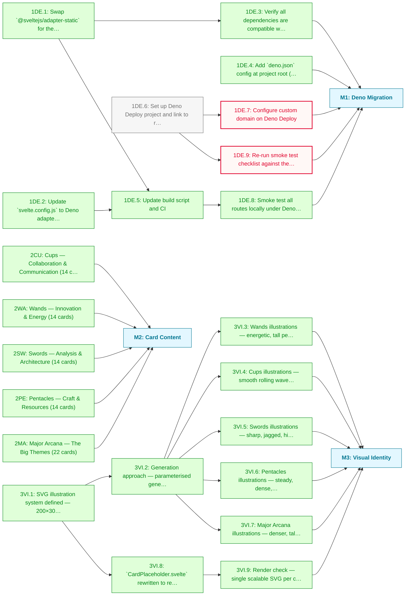

# Arcana of Code MVP Roadmap

Public launch: Deno Deploy migration, all 78 cards with prototype content, Joy Division-esque SVG illustrations.

**Critical path:** `1DE.6 → 1DE.7, 1DE.9`; the Deno Deploy account setup (manual, requires dash.deno.com access) unblocks the custom domain and live smoke test.

---

## Milestone 1: Deno Migration

**Goal:** Convert the SvelteKit site from Node/adapter-static to SvelteKit + Deno Deploy. Site live at a real domain.

- [x] **1DE.1**: Swap `@sveltejs/adapter-static` for the Deno adapter
  - Note: `@sveltejs/adapter-deno` does not exist; used the community-standard `svelte-adapter-deno@0.9.1`, which required upgrading SvelteKit 1 → 2 (plus Vite 4 → 5, Svelte 4.0 → 4.2). `svelte-check` passes clean.
- [x] **1DE.2**: Update `svelte.config.js` to Deno adapter config (`out: 'build'`, `precompress: true`)
- [x] **1DE.3**: Verify all dependencies are compatible with Deno runtime
  - Note: Only runtime dep is `@fontsource/inter` (bundled CSS at build); no Node-only builtins in app code; server boots and serves under Deno 2.6
- [x] **1DE.4**: Add `deno.json` config at project root (`deno task start` runs the built server)
- [x] **1DE.5**: Update build script and CI
  - Note: `npm run build` produces the Deno server; `.github/workflows/deploy.yml` deploys via `deployctl` on push to main (project name placeholder until 1DE.6)
- [ ] **1DE.6**: Set up Deno Deploy project and link to repository
  - Note: Manual: requires dash.deno.com account access; see DEPLOY.md
- [ ] **1DE.7**: Configure custom domain on Deno Deploy _(blocked: depends on 1DE.6)_
  - Note: Manual: requires DNS access; see DEPLOY.md
- [x] **1DE.8**: Smoke test all routes locally under Deno (homepage, catalog, draw, about, card pages incl. majors, 404 case)
  - Note: All pass
- [ ] **1DE.9**: Re-run smoke test checklist against the live deployment _(blocked: depends on 1DE.6)_

---

## Milestone 2: Card Content

**Goal:** All 78 cards have prototype essays — enough to feel like a real artefact worth sharing.

**Complete: 78/78.** All five groups written to WRITING_GUIDE.md (tone, anti-patterns, length, British spelling), validated against the schema (ids, ranks, keyword/connection counts, no dangling or self connections), and merged into `src/lib/data/cards.json` in canonical deck order. Prototype quality by design — individual cards can be rewritten as inspiration strikes.

- [x] **2CU**: Cups — Collaboration & Communication (14 cards)
- [x] **2WA**: Wands — Innovation & Energy (14 cards)
- [x] **2SW**: Swords — Analysis & Architecture (14 cards)
- [x] **2PE**: Pentacles — Craft & Resources (14 cards)
- [x] **2MA**: Major Arcana — The Big Themes (22 cards)

---

## Milestone 3: Visual Identity

**Goal:** Replace placeholder component symbols with Joy Division Unknown Pleasures-esque SVG line art — one unique illustration per card.

- [x] **3VI.1**: SVG illustration system defined — 200×300 viewBox (2:3), white 1.2px ridge lines on black (Unknown Pleasures idiom), occluding silhouette fills, card label (Roman numerals for majors) and name as SVG text
- [x] **3VI.2**: Generation approach — parameterised generator in `src/lib/illustration.ts`: deterministic seed from card id (xmur3 + mulberry32), suit-specific line character, rank-scaled intensity; no image assets _(depends on 3VI.1)_
- [x] **3VI.3**: Wands illustrations — energetic, tall peaks (generated, 14 cards) _(depends on 3VI.2)_
- [x] **3VI.4**: Cups illustrations — smooth rolling waves (generated, 14 cards) _(depends on 3VI.2)_
- [x] **3VI.5**: Swords illustrations — sharp, jagged, high-frequency (generated, 14 cards) _(depends on 3VI.2)_
- [x] **3VI.6**: Pentacles illustrations — steady, dense, modest (generated, 14 cards) _(depends on 3VI.2)_
- [x] **3VI.7**: Major Arcana illustrations — denser, taller, more dramatic (generated, 22 cards) _(depends on 3VI.2)_
- [x] **3VI.8**: `CardPlaceholder.svelte` rewritten to render the per-card SVG _(depends on 3VI.1)_
- [x] **3VI.9**: Render check — single scalable SVG per card; verified rasterised output across suits; catalog page weighs 1.45MB raw / ~175KB gzipped (precompressed brotli emitted at build) _(depends on 3VI.8)_

---

## Dependency Diagram

---

## Beyond MVP

- Multi-card spreads for complex scenarios (e.g. "I'm choosing between two architectures")
- Connection graph visualisation — navigate the web of card relationships
- Graph database migration (Neo4j or similar) when connections become complex enough to warrant it
- Enhanced card interactions — flip animations, keyword filtering
- Full 78-card connection mapping
