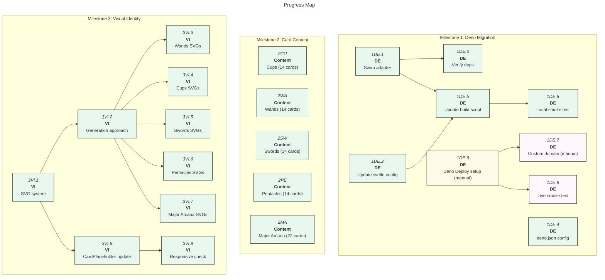

# Arcana of Code: MVP

|               | Status                      | Next Up                               | Blocked |
| ------------- | --------------------------- | ------------------------------------- | ------- |
| **Migration** | Code complete               | Deno Deploy account + domain (manual) | —       |
| **Content**   | 78/78 cards written         | Editorial pass as desired             | —       |
| **Visuals**   | Generated SVG line art live | —                                     | —       |

---

## Contents

- [Milestones](#milestones)
  - [Milestone 1: Deno Migration](#m1)
  - [Milestone 2: Card Content](#m2)
  - [Milestone 3: Visual Identity](#m3)
- [Progress Map](#map)
- [Beyond MVP](#post-mvp)

---

## Milestones

<a name="m1"><h3>Milestone 1: Deno Migration</h3></a>

> [!IMPORTANT]
> **Goal:** Convert the SvelteKit site from Node/adapter-static to SvelteKit + Deno Deploy. Site live at a real domain.

<a name="m1-doing"><h4>In Progress (Milestone 1)</h4></a>

_(none)_

<a name="m1-todo"><h4>To Do (Milestone 1)</h4></a>

- [ ] 1DE.6. Set up Deno Deploy project and link to repository — **manual: requires dash.deno.com account access; see DEPLOY.md**
- [ ] 1DE.7. Configure custom domain on Deno Deploy — **depends on 1DE.6; manual: requires DNS access; see DEPLOY.md**
- [ ] 1DE.9. Re-run smoke test checklist against the live deployment — **depends on 1DE.6**

<a name="m1-blocked"><h4>Blocked (Milestone 1)</h4></a>

_(none)_

<a name="m1-done"><h4>Completed (Milestone 1)</h4></a>

- [x] 1DE.1. Swap `@sveltejs/adapter-static` for the Deno adapter — _note: `@sveltejs/adapter-deno` does not exist; used the community-standard `svelte-adapter-deno@0.9.1`, which required upgrading SvelteKit 1 → 2 (plus Vite 4 → 5, Svelte 4.0 → 4.2). `svelte-check` passes clean._
- [x] 1DE.2. Update `svelte.config.js` to Deno adapter config (`out: 'build'`, `precompress: true`)
- [x] 1DE.3. Verify all dependencies are compatible with Deno runtime — only runtime dep is `@fontsource/inter` (bundled CSS at build); no Node-only builtins in app code; server boots and serves under Deno 2.6
- [x] 1DE.4. Add `deno.json` config at project root (`deno task start` runs the built server)
- [x] 1DE.5. Update build script and CI — `npm run build` produces the Deno server; `.github/workflows/deploy.yml` deploys via `deployctl` on push to main (project name placeholder until 1DE.6)
- [x] 1DE.8. Smoke test all routes locally under Deno (homepage, catalog, draw, about, card pages incl. majors, 404 case) — all pass

---

<a name="m2"><h3>Milestone 2: Card Content</h3></a>

> [!IMPORTANT]
> **Goal:** All 78 cards have prototype essays — enough to feel like a real artefact worth sharing.

**Complete: 78/78.** All five groups written to WRITING_GUIDE.md (tone, anti-patterns, length, British spelling), validated against the schema (ids, ranks, keyword/connection counts, no dangling or self connections), and merged into `src/lib/data/cards.json` in canonical deck order. Prototype quality by design — individual cards can be rewritten as inspiration strikes.

<a name="m2-doing"><h4>In Progress (Milestone 2)</h4></a>

_(none)_

<a name="m2-todo"><h4>To Do (Milestone 2)</h4></a>

_(none — editorial passes welcome but not required for MVP)_

<a name="m2-blocked"><h4>Blocked (Milestone 2)</h4></a>

_(none)_

<a name="m2-done"><h4>Completed (Milestone 2)</h4></a>

- [x] 2CU.1–14. Cups — Collaboration & Communication (14 cards)
- [x] 2WA.1–14. Wands — Innovation & Energy (14 cards)
- [x] 2SW.1–14. Swords — Analysis & Architecture (14 cards)
- [x] 2PE.1–14. Pentacles — Craft & Resources (14 cards)
- [x] 2MA.1–22. Major Arcana — The Big Themes (22 cards)

---

<a name="m3"><h3>Milestone 3: Visual Identity</h3></a>

> [!IMPORTANT]
> **Goal:** Replace placeholder component symbols with Joy Division _Unknown Pleasures_-esque SVG line art — one unique illustration per card.

<a name="m3-doing"><h4>In Progress (Milestone 3)</h4></a>

_(none)_

<a name="m3-todo"><h4>To Do (Milestone 3)</h4></a>

_(none)_

<a name="m3-blocked"><h4>Blocked (Milestone 3)</h4></a>

_(none)_

<a name="m3-done"><h4>Completed (Milestone 3)</h4></a>

- [x] 3VI.1. SVG illustration system defined — 200×300 viewBox (2:3), white 1.2px ridge lines on black (_Unknown Pleasures_ idiom), occluding silhouette fills, card label (Roman numerals for majors) and name as SVG text
- [x] 3VI.2. Generation approach — parameterised generator in `src/lib/illustration.ts`: deterministic seed from card id (xmur3 + mulberry32), suit-specific line character, rank-scaled intensity; no image assets
- [x] 3VI.3. Wands illustrations — energetic, tall peaks (generated, 14 cards)
- [x] 3VI.4. Cups illustrations — smooth rolling waves (generated, 14 cards)
- [x] 3VI.5. Swords illustrations — sharp, jagged, high-frequency (generated, 14 cards)
- [x] 3VI.6. Pentacles illustrations — steady, dense, modest (generated, 14 cards)
- [x] 3VI.7. Major Arcana illustrations — denser, taller, more dramatic (generated, 22 cards)
- [x] 3VI.8. `CardPlaceholder.svelte` rewritten to render the per-card SVG
- [x] 3VI.9. Render check — single scalable SVG per card; verified rasterised output across suits; catalog page weighs 1.45MB raw / ~175KB gzipped (precompressed brotli emitted at build)

---

<a name="map"><h2>Progress Map</h2></a>

---

<a name="post-mvp"><h2>Beyond MVP</h2></a>

- Multi-card spreads for complex scenarios (e.g. "I'm choosing between two architectures")
- Connection graph visualisation — navigate the web of card relationships
- Graph database migration (Neo4j or similar) when connections become complex enough to warrant it
- Enhanced card interactions — flip animations, keyword filtering
- Full 78-card connection mapping
